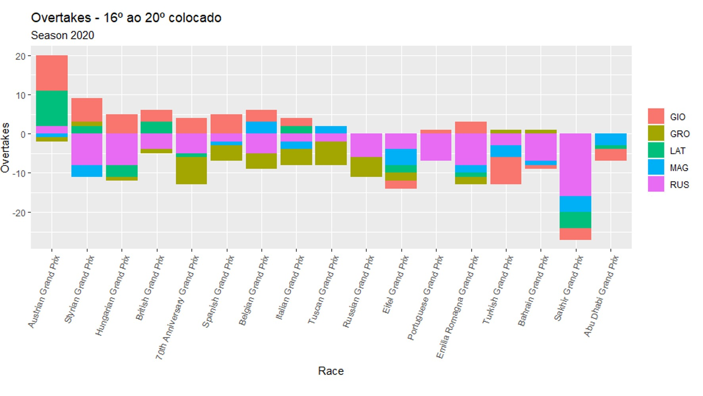

```{r setup, include=FALSE}
knitr::opts_chunk$set(echo = TRUE)
```

## Introdução

Para o projeto de R para ciência dos dados foi escolhido o tema *Fórmula 1*. A Fórmula 1 (F1) é a competição mais popular do automobilismo.
O esporte acontece desde a década de 50 e desde então vem ganhando fama.
A fórmula 1 funciona da seguinte maneira: existe 10 equipes, cada uma tem dois pilotos que copõem o grid na temporada. Estes pilotos competem individualmente acumulando pontos ao longo do campenonato, enquanto seus pontos acumulados são somados para a contagem da equipe (construtores). Com isso, o piloto e a construtora com mais pontos no final da temporada são os campeões mundiais. É importante ressaltar que são disputas diferentes dentro da mesma competição, já que não necessariamente o piloto campeão faz parte da equipe campeã.
Durante o campeonato acontecem, em torno de 21 corridas por vários lugares do mundo. A corrida acontece aos domingos e para saber que posição cada piloto irá iniciar tem o qualifying no sábado na qual organiza a largada de acordo com o tempo feito uma volta: quanto mais rápido, melhor.

Como visto, apesar da competição entre os pilotos transpassar a imagem de um esporte individual, este esporte é muito mais que o piloto, porque o time não é apenas ele e sim os engenheiros, mecânicos, trabalhadores de fábrica, etc. Entretanto, em nossa análise será aprofundada no desempenho individual dos pilotos. 
(desenvolver mais, mas depende em que vamos analisar)


## Limpeza dos Dados
A base de dados usada foi do [Kaggle](https://www.kaggle.com/rohanrao/formula-1-world-championship-1950-2020?select=races.csv). Nela consiste nos seguintes datasets:

- circuits.csv : Contêm a informação sobre os curcuitos que ocorrem na F1.
- constructor_results.csv : Resultado da corrida do campeonato das construtoras.
- constructor_standings.csv : Resultado final do campeonato das construtoras.
- constructor.csv : Informações sobre as construtoras da F1.
- driver_standings.csv : Resultado final do campeonato dos pilotos.
- drivers.csv : Informações sobre os pilotos da F1.
- lap_times.csv : Informações sobre as voltas.
- pit_stop.csv : Informações sobre as paradas de cada corrida.
- qualifying.csv : Informações sobre o qualifying.
- races.csv : Informações sobre as corridas da F1.
- results.csv : Resultados da corrida.

Como existem muitos dados (informações desde 1950 até hoje em dia) não foi possível juntar todas as tabelas em um dataframe só decidimos que iriamos observar os fenômenos da fórmula 1 da atualidade e os dados seriam dividos em dois dataframe: um dataframe das construtoras e outra com as informações dos pilotos e suas corridas. 

Criando então a base de dados das construtoras foi eliminado algumas colunas desnecessárias, outras renomeada. Ao limpar, para juntar as bases de dados foi feito o join. Podemos ver no exemplo abaixo como nossa limpeza foi.
```
constructor_results <- select(constructor_results, -c(constructorResultsId, status))
constructors <- select(constructors, -c(name, url))

constructor <- constructor_results %>% 
  select(race_constructor_points = points) %>% 
  inner_join(constructors, by = "constructorId")

```
Realizamos essa etapa até juntar todas as bases necessárias.
Em alguns casos também foram feitos alguns ajustes como no caso do time: Aston Martin. Esta era conhecida como Force India até que em 2018 mudou novamente seu nome para Racing Point. Esse ano seu nome foi mudado novamente para Aston Martin. Logo, foi feito um mutate para poder ter os dados ao longo dos anos. Mesmo fenômeno para Alpha Tauri na qual seu nome era Toro Rosso.
Portanto fizemos o seguinte mutate:
```
constructor <- constructor %>% 
  mutate(constructorRef = replace(constructorRef, constructorRef == 'racing_point', 'aston_martin')) %>% 
  mutate(constructorRef = replace(constructorRef, constructorRef == 'force_india', 'aston_martin')) %>% 
  mutate(constructorRef = replace(constructorRef, constructorRef == 'toro_rosso', 'alphatauri')) %>% 
  filter(raceId <= 1073)
```

## Análise
O primeiro gráfico a ser feito foi comparação dos pilotos ao longo das temporadas 2018/2019/2020. O algoritmo para as três base de dados foram:

```
f1_18_20 %>% 
  filter(year == 2020, round == 17) %>% 
  ggplot(aes(x = reorder(code, standing_driver_points), y = standing_driver_points, fill = code)) +
  geom_col() +
  labs(x = "Driver", y = "Points", 
       title = "Championship", 
       subtitle = "Season 2020") +
  theme(legend.title = element_blank(),
        legend.position = "none") +
  coord_flip()
    
```


Na fórmula 1 é comum observar uma hegemonia de piloto, e principalmente, equipe, durante um determinado número de temporadas subsequentes. No período selecionado para análise não foi diferente. Desde 2018, a equipe Mercedes, composta pelos pilotos Lewis Hamilton (HAM) e Valtteri Bottas (BOT), estava no domínio da competição. Nos três anos, o vencedor do campeonato mundial foi o inglês Hamilton, único piloto a ultrapassar os 350 pontos nas temporadas. Outra equipe que sempre se manteve no topo é a Red Bull Racing (RBR), fidelizada na competição após 4 vitórias consecutivas do alemão Sebastian Vettel nos anos de 2010 à 2013, que hoje não desempenha da mesma forma. Sobre a equipe, o jovem experiente Max Verstappen (VER) reviveu a esperança da construtora em conquistar mais títulos na competição, performando bem nas corridas, alcançando o segundo lugar em 2018, e mantendo a terceira posição nos anos seguintes, atrás apenas dos dois pilotos da Mercedes. Entretanto, a trajetória do piloto tetra campeão foi diferente. Vettel migrou para a Ferrari e passou por momentos tão ruins, que suas habilidades e potencial foram postos a prova. O piloto teve uma queda de desempenho nítida de 2018 até 2020, perdendo credibilidade e performando pior que seu companheiro de equipe, Charles Leclerc (LEC). Equanto Leclerc terminou o campeonato na 8ª posição, Sebastian Vettel se contete com o 13º lugar.
Outro aspecto interessante de destacar é sobre o grid. Uma nova geração de pilotos está surgindo na Fórmula 1, e a prova disso são a aparição de alguns nomes diferentes na tabela do campeonato. Nomes como Leclerc, Sainz, Gasly, Albon, Norris e Russel soam diferente para os ouvidos de pessoas que estavam acostumadas a ver Fernando Alonso, Michael Schumacker, Jeson Button, e companhia nos circuitos da F1. Esses jovens prodígios assumiram os lugares de grandes figuras do esporte e estão mostrando serviço nos primeiros anos na competição. Em 2018, apenas Carlos Sainz terminou entre os 10 primeiros, enquanto em 2020, quatro dos seis nomes mencionados performaram entre os 10 melhores do grid. 
Além disso, foi explicado na introdução dessa análise que há 20 pilotos no grid da F1, havendo 2 representantes por cada equipe. Entretanto, em 2020, pode-se observar que a tabela de pontuação do campeonato apresenta 23 pilotos. Isso é consequência da pandemia da COVID-19. Com a circulação do coronavírus em alta por todo o planeta, alguns pilotos acabaram sendo contaminados e tiveram que se afastar por duas semanas, como manda o protocolo da OMS (Organização Mundial da Saúde). Assim, nesses casos, foi necessário realizar uma substituição de pilotos em momentos pontuais, em que as equipes afetadas recorriam a seus pilotos reservas para assumir a posição em determinada corrida. Em exceção a essas ocasiões, um fato importante que marcou o ano de 2020, além da pandemia, foi o acidente sofrido pelo piloto da Haas, Romain Grosjean, vítima de uma explosão após uma colisão contra o a estrutura de proteção do GP do Barein, antepenúltima etapa do campeonato mundial. O piloto sobreviveu, mas sofreu queimaduras em partes do corpo, responsável por tirá-lo da temporada com 2 corridas de antecedência, obrigando com que a equipe acionasse seu piloto reserva.


Na Fórmula 1, o objetivo do piloto é ser campeão mundial. Para alcançar esse objetivo macro, ele deve acumular pontos em corridas ao longo da temporada. Assim, pode-se concluir que o piloto da Fórmula 1 tem subobjetivos: vencer corridas. Ser campeão de um Grand Prix significa ser o melhor piloto da etapa, e se aproximar cada vez mais do objetivo final. Entretanto, ter mais vitórias ao longo da temporada não significa encerrar a competição na frente dos demais adversários. Nos três anos analisados, o campeão mundial foi, também, o que mais venceu ao longo do ano, já que a quantidade de corridas vencidas por Lewis Hamilton ultrapassou o dobro comparado com o segundo colocado em todos os anos. Porém, em 2018, a classificação mundial teve o seguinte pódio: Hamilton, Vettel e Raikonnen, respectivamente, e a quantidade de vitórias apresentou a seguinte ordem decrescente: Hamilton, Vettel e Verstappen. Percebe-se que o terceiro colocado do campeonato não foi o terceiro piloto que mais venceu corridas no ano, o que demonstra que a competição também leva muito em consideração a estabilidade no desempenho.
Em 2020 aconteceu algo interessante que retifica a importância da estabilidade. O segundo colocado foi decidido por essa característica, pois tanto Bottas quanto Verstappen venceram a mesma quantidade de corridas. O resultado final foi bem acirrado, porém, o companheiro de equipe de Hamilton, Valtteri Bottas, conquistou o segundo lugar do campeonato com uma leve vantagem sobre o rival Max Verstappen. Como os dois pilotos venceram o mesmo número de Grand Prix, essa diferença se deveu ao fato do finlandês ter sido mais estável durante o campeonato, ou seja, o segundo colocado performou melhor que o terceiro nas etapas em que o subobjetivo não foi alcançado.
Em suma, é muito importante que o piloto se mantenha concentrado durante a temporada inteira, já que vencer algumas corridas e performar mal em outras não é suficiente.


Como dito anteriormente, existe uma hegemonia de construtores que ultimamente estão em primeiro: RedBull e Mercedes. Vemos no gráfico acima então que Mercedes está sendo a construtora vencedora nos últimos tempos, e logo em seguida está a RedBull. 
Outro fenômeno que podemos observar é a Williams. Está construtora é uma das mais antigas com nove prêmios. Apesar de em 2016 ainda estar em uma posição boa, ao longo dos anos foram perdendo sua posição, sendo uma das últimas construtoras no overall.


Durante as corridas da Fórmula 1 existem as ultrapassagens. A ultrapassagem é um desafio, pois depende da corrida, do carro e do piloto. A estratégia de ultrapassagem mais usada seria nas retas, pois nas retas é possível utilizar o DRS (Drag Reduction System). O DRS é uma tecnologia que permite reduzir o arrasto aerodinâmico, aumentando então a velocidade do carro. Este método só pode ser usado em zonas de DRS (partes do circuito que são retas) e quando o piloto está no mínimo um segundo atrás do piloto em que pretende ultrapassar. 
Como citado nos gráficos anteriores, sabemos que os melhores pilotos atualmente são Lewis Hamilton e Max Verstappen. Assim, ao ver o gráfico acima se destaca que Max Verstappen perdeu muitas posições (tendo ultrapassagens negativas). Ao ver então o que aconteceu vemos que deu um problema técnico no carro e teve que desistir da corrida, tendo então a posição de último lugar no Grand Prix da Áustria. 
Ao observar o Hamilton vemos que não há muita variedade. Sabendo então que ele normalmente é um dos primeiros, sua posição varia pouco entre as primeiras posições, sempre garantido então pontos.
Além disso, vemos que quem teve maior variância de ultrapassagem é o piloto Sergio Perez. Sérgio Perez fazia parte da construtora Racing Point (atualmente Aston Martin). Apesar de ter algumas corridas onde perdeu posições, tiverem corridas ontem ganhou posições e até mais do que perdeu. Duas corridas se destacam: Abu Dhabi Grand Prix e Syrian Grand Prix. A primeira foi uma das últimas corridas da temporada. Este estava sem time para correr na próxima temporada, então tinha que se destacar para permanecer na Fórmula 1. A pressão era grande, e logo na primeira volta ele teve um pequeno acidente e ficou na última posição. Apesar de tudo indicar que seria impossível obter as posições perdidas, Sérgio Perez venceu a corrida sendo o único piloto a sair da última posição e terminar em primeiro lugar.


Ao analisar as ultrapassagens ao longo da temporada dos pilotos que terminaram o campeonato entre a sexta e décima quinta posição, nota-se uma diferença visual grande comparado com o gráfico de ultrapassagem dos pilotos que encerraram a temporada nas cinco primeiras colocações. É notório que esse pelotão realizou mais ultrapassagens ao longo do campeonato, já que visualmente esses gráficos estão mais preenchidos eu o outro. Sobre esse fato é importante destacar que isso acontece, pois tanto os carros, quanto os pilotos são mais equilibrados em performance. Quem assiste à Fórmula 1, muitas vezes, está preocupado com o pelotão da frente, especialmente em quem ganha a corrida. Entretanto, se mudar a visão de interesse, tem-se uma competição muito mais emocionante e acirrada entre esses pilotos.
O pelotão do sexto ao décimo colocado tem característica, em geral, de realizar ultrapassagens e conquistar posições, uma vez que a quantidade de valores positivos no gráfico supera a quantidade de valores negativos. Essa característica demonstra realmente a qualidade dos pilotos, já que os carros são muito semelhantes em termos de potência e aerodinâmica. Por outro lado, o pelotão do décimo primeiro ao décimo quinto tem característica, em geral, de perder posições, uma vez que a quantidade de valores negativos no gráfico supera a quantidade de valores positivos. Mais uma vez, isso está atrelado a qualidade do piloto, indicando que há outros que performam melhor o grid.


Por fim, o pelotão dos últimos 5 colocados. Esses pilotos, assim como aqueles do pelotão do décimo primeiro ao décimo quinto, têm características de perder mais posições do que conquistar. Entretanto, é um gráfico que tem aspectos semelhante ao primeiro pelotão, pelo fato de não haver tantas ultrapassagens. Ao bater o olho no gráfico, o olhar se direciona para a cor roxa, que mostra o desempenho do jovem piloto George Russel. Ele apresenta valores ruins de ultrapassagens, sempre perdendo posições ao longo da corrida. Ele é um piloto que costuma ter ótimos desempenhos na classificação (treino de formação de largada da corrida). Assim, sem o auxílio do carro, ele não consegue manter o ritmo nas corridas, perdendo muitas posições em todas. Isso confirma que há uma diferença na performance dos carros, já que ambos os pilotos da Haas e Williams estão presentes nesse grupo. Não é possível julgar apenas a qualidade do piloto, uma vez que a competição também é coletiva, que leva muito em consideração o desempenho dos construtores. Além disso, ao pensar que esse esporte é extremante restrito, havendo apenas 20 pilotos do mundo inteiro, seria um equívoco muito grande concluir que pilotos que se encontram em posições ruins, são de fato, ruins. Eles estão entre os melhores 20 do planeta, e a qualidade dos carros é fator fundamental para definir os melhores entre os melhores.


O Grande Prêmio de Mônaco é a mais tradicional, importante e prestigiada prova do calendário da Fórmula 1. Ele é disputado em um circuito de rua, em Monte Carlo, Mônaco, que exige dos pilotos muita precisão, devido a uma grande quantidade de curvas e a estreita largura das ruas que formam o percurso. Assim, nada mais válido que analisar quais são os pilotos que mais venceram nessa pista. 
Como pode-se observar, pelas informações coletadas na plataforma Kaggle, o hepta campeão mundial que teve sua carreira interrompida por um acidente de ski, Michael Schumacher, é o maior vencedor do Grande Prêmio de Mônaco em toda a história do esporte. Entretanto, nota-se uma inconsistência nesse dado, já que se sabe que o brasileiro e ídolo do país, Ayrton Senna, é o maior vencedor da pista com 6 vitórias.
Além disso, segundo os dados, Hamilton, Vettel, Alonso e Raikonnen aparecem na lista de pilotos que já conquistaram o troféu em Monte-Carlo e que fazem parte da competição atualmente.


Outra análise interessante de se fazer é em relação ao país de origem dos maiores vencedores da competição. Como mostra o gráfico, Alemanha e Inglaterra foram os melhores países representados em termos de performance na história do esporte. Os pilotos Michael Schumacher (alemão) e Lewis Hamilton (inglês), maiores vencedores da competição, são grandes responsáveis pelos domínios de seus países na história.
Chile, República-Tcheca, Dinamarca, Hungria, Índia, Indonésia, Irlanda, Japão, Lichtensteiner, Malásia, Portugal, Rodésia, Rússia, Tailândia e Uruguai foram os países que não conquistaram troféus na F1 mesmo tendo representantes na competição.
Os brasileiros, por sua vez, conquistaram 8 vezes o título mundial da Fórmula 1, sendo o terceiro país, junto com a Finlândia, a ganhar o troféu mais vezes. Esse valor é alto por conta, principalmente, de dois personagens que marcaram a história do automobilismo, Ayrton Senna e Nelson Piquet.

